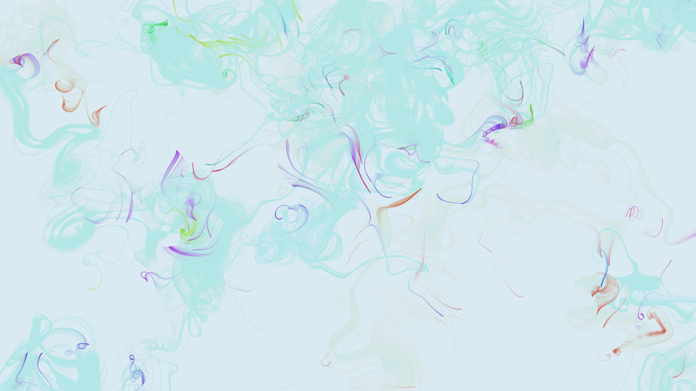

# fluid_dynamics_ink_marbling_2d

## Metadata
- **Date**: 2026-06-15
- **Theme**: An ethereal 20s simulation of ink marbling on water, where virtual drops of ink are dropped and swir
- **Technique**: A dense flow field displaces a highly detailed set of colored particles representing ink. The particles leave trails, blending colors. The flow field is driven by Py5's `py5.os_noise` generating a curl noise-like technique where the angle of movement is derived from 2D perlin noise multiplied by $4\pi$. The slow trailing effect is achieved by painting a semi-transparent background rectangle each frame.
- **Logic Lab Reference**: 

## Concept
An ethereal 20s simulation of ink marbling on water, where virtual drops of ink are dropped and swirled by procedural vortex fields to simulate Suminagashi or Turkish Ebru marbling effects.

## Technical Details
- **Renderer**: Unknown
- **Simulation**: Unknown
- **Visuals**: Unknown
- **Animation**: Unknown
