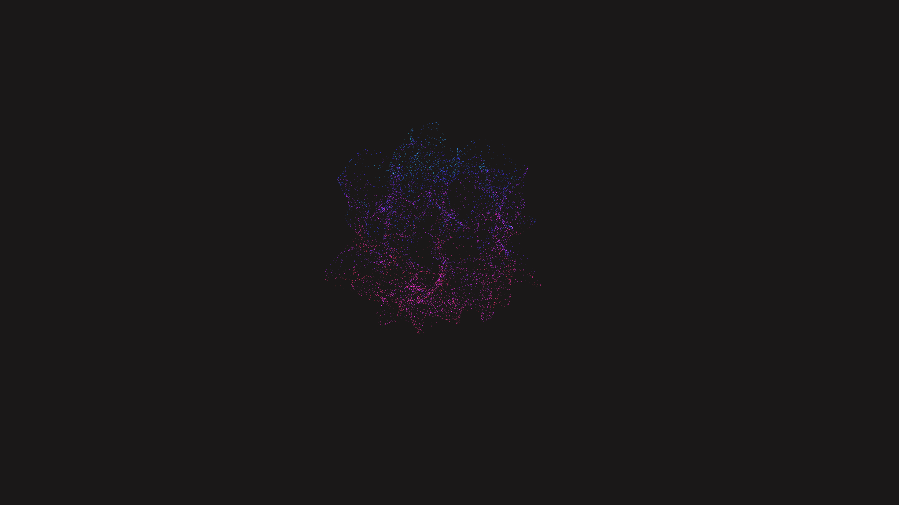

# fluid_nebula_particle_attractor_3d

## Details
- **Date**: 2026-06-06
- **Format**: Animation (10s @ 60fps)
- **Theme**: A swirling vortex of millions of points mimicking a beautiful nebula with varying shades of teal and pink.

## Technique
A 3D spiral particle attractor with 15000 points. Vertices are distorted by 3D OpenSimplex noise, creating a swirling fluid effect.

