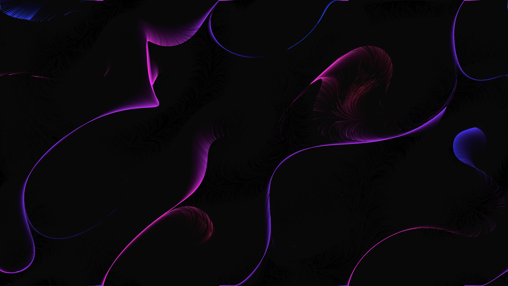

# fluid_perlin_vector_field_iridescence_2d

## Metadata
- **Date**: 2026-06-14
- **Theme**: An animated 15s sequence showing 50,000 microscopic glowing particles swirling into turbulent, iride
- **Technique**: A high-density 2D particle simulation running entirely on vectorized Numpy arrays for speed. Particle velocities are derived from a 3D OpenSimplex noise field. The background is minimally cleared each frame with a highly transparent black to create long, overlapping motion blur trails. Colors shift through a holographic spectrum based on particle angles.
- **Logic Lab Reference**: 

## Concept
An animated 15s sequence showing 50,000 microscopic glowing particles swirling into turbulent, iridescent rivers over a black abyss.

## Technical Details
- **Renderer**: Unknown
- **Simulation**: Unknown
- **Visuals**: Unknown
- **Animation**: Unknown
