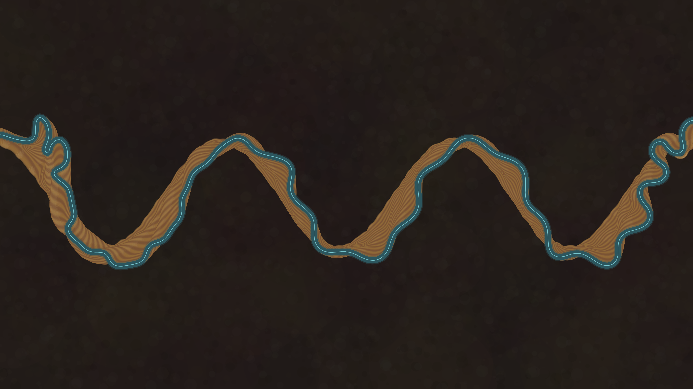

# fluvial_meander_oxbow_migration_2d

## Metadata
- **Date**: 2026-06-14
- **Theme**: - **Theme**: The quiet, geologic patience of a meandering river editing the land
- **Technique**: Unknown
- **Logic Lab Reference**: 

## Concept
- **Theme**: The quiet, geologic patience of a meandering river editing the land.
- **Technique**: A simplified Howard & Knutson meander model. A numpy centerline
  migrates outward along its normal at a rate set by upstream-weighted local
  curvature, so bends amplify and sharpen. The line is arc-length resampled each
  step, and `scipy.spatial.cKDTree` detects neck cutoffs — when two distant parts
  of the channel touch, the enclosed loop is abandoned as a permanent oxbow lake
  and the river takes the shortcut.
- **Floodplain memory**: A persistent `py5` graphics buffer accumulates every
  past channel position as low-alpha sediment plus a thin inner-bank accretion
  ridge, building the concentric scroll-bar texture left by real point bars.

## Technical Details
- **Renderer**: Unknown
- **Simulation**: Unknown
- **Visuals**: Unknown
- **Animation**: - **Format**: Animation, ~20s @ 60fps, 3840×2160 - `output.mp4` — rendered animation (git-ignored) - `fluvial_meander_oxbow_migration_2d_p1.png` — preview snapshot
