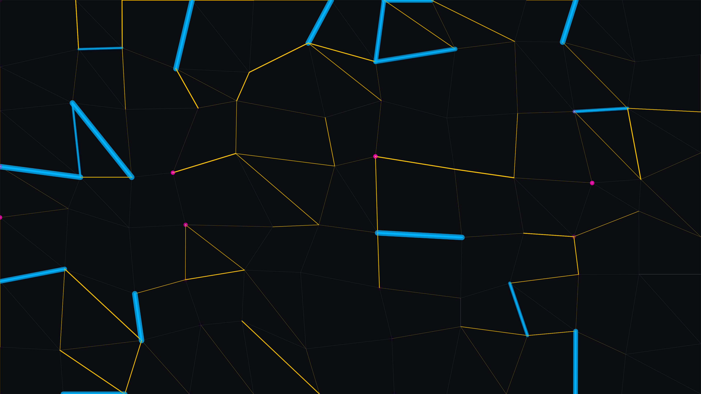

# flux_lattice

## Metadata
- **Date**: 2026-05-04
- **Theme**: Energy distribution, urban metabolism, hidden currents, systemic flow
- **Technique**: Stochastic lattice routing, pulse-width modulated currents, node-leakage sparks, jittered grid subdivision

## Concept
A dark, dense network of glowing conduits where "power" surges through neon cobalt trunk lines and gold capillaries, while ghostly magenta sparks reveal high-pressure leakage at the nodes.

## Technical Details
- **Renderer**: P2D
- **Simulation**: Stochastic lattice routing
- **Visuals**: pulse-width modulated currents, node-leakage sparks, jittered grid subdivision
- **Animation**: 10s @ 60fps (typical)
