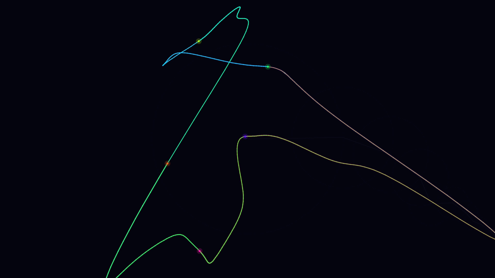

# Fourier Epicycles

Fifteen nested rotating circles (epicycles) drive six simultaneous tips tracing one complex closed curve; each chain is offset by a sixth of the period so the shape fills in from six directions at once. Rainbow trails — blue through teal, magenta, orange, lime, and gold — accumulate over 360 frames to reveal the Fourier series as geometry in motion.
