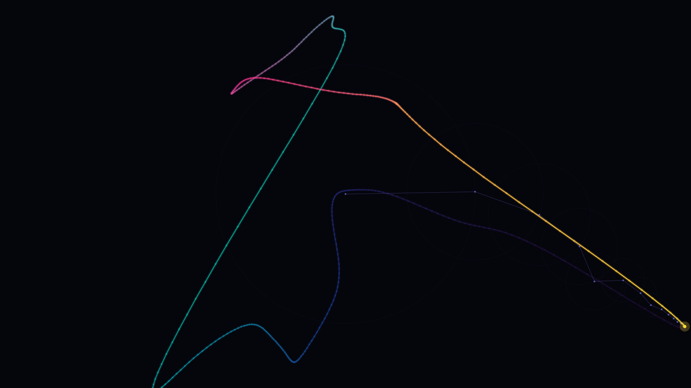

# fourier_epicycles

## Metadata
- **Date**: 2026-05-03 (Polished)
- **Theme**: mathematics, Fourier analysis, Iridescent Cosmos, spectral harmonics
- **Technique**: Fourier epicycles (15 nested rotating circles), single-chain trace, multi-stop iridescent color gradient, enhanced glow effects

## Concept
A complex chain of 15 rotating epicycles traces a vibrant, iridescent path across a deep space background; the multi-stop spectral gradient and enhanced glow transform the mechanical trace into a rhythmic, celestial light display.

## Technical Details
- **Renderer**: P2D
- **Simulation**: Fourier epicycles (15 nested rotating circles)
- **Visuals**: single-chain trace, multi-stop iridescent color gradient, enhanced glow effects
- **Animation**: 10s @ 60fps (typical)
