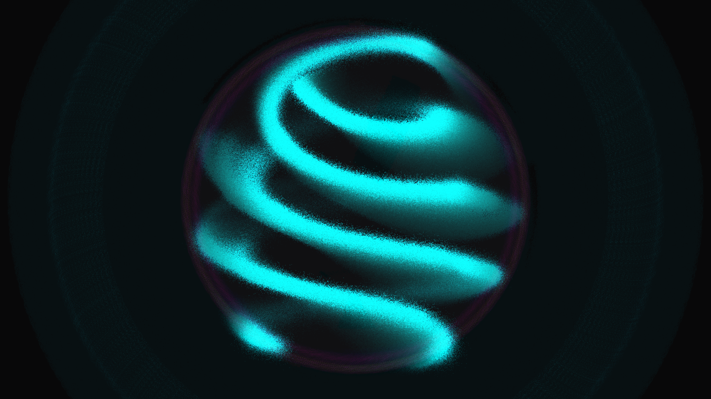

# fput_recurrence_lattice

## Metadata
- **Date**: 2026-05-18
- **Theme**: The paradox of a non-linear lattice of coupled oscillators that, instead of thermalizing and distributing energy evenly, periodically returns to its initial low-frequency state in a majestic act of coherence.
- **Technique**: Vectorized 1D/2D FPUT chain simulation with alpha/beta non-linear coupling, mapped to a 3D helical space curve of 150,000 glowing particles. The color temperature and particle size are modulated by the local energy density, and the modal energies are visualized as concentric background orbits of light.
- **Logic Lab Reference**: None

## Concept
A simple, clean electric cyan sine wave sweeps across the dark void, twisting into an elegant double helix. As time progresses, the smooth curve rapidly shatters into high-frequency amethyst ripples, mimicking thermalized noise, before converging back into the pristine initial wave in a blinding gold pulse of resonance.

## Technical Details
- **Renderer**: P2D
- **Simulation**: Vectorized alpha-FPUT lattice with Velocity Verlet integration and 22 substeps per frame.
- **Visuals**: Manual 3D-to-2D perspective projection with additive blending, volumetric depth grouping, and real-time modal Fourier spectrum visualization.
- **Animation**: 15 seconds at 60fps
