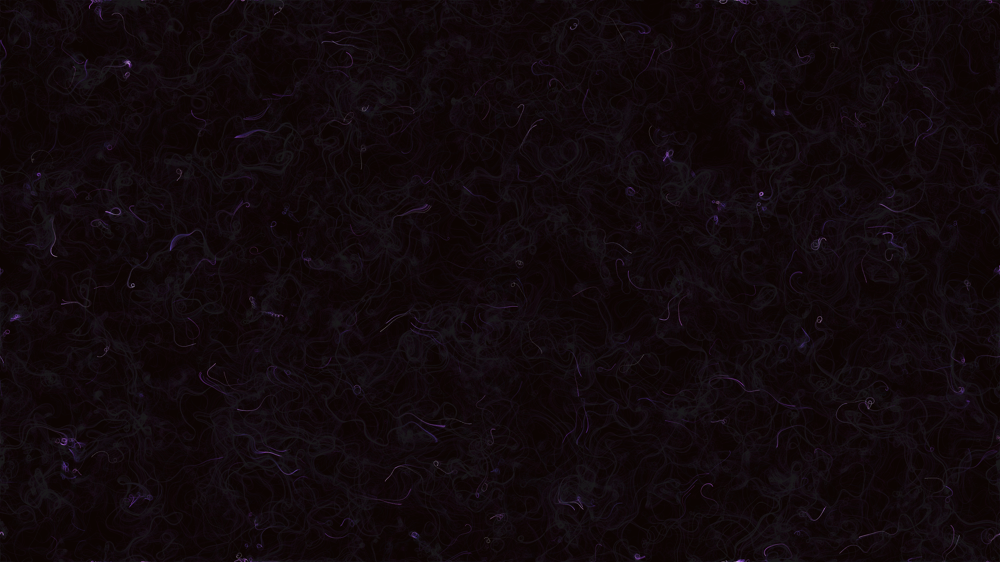

# fractal_brownian_motion_nebula_2d

## Metadata
- **Date**: 2026-06-15
- **Theme**: An animated 20s sequence of a swirling, highly detailed interstellar nebula cloud made using Fractal
- **Technique**: A particle system of 20,000 tiny semi-transparent particles is driven by an fBm flow field, leaving long trails that build up into glowing cloud structures. The flow field is constructed using 3 octaves of `py5.os_noise`. A fast numpy implementation is used to update particle positions efficiently. Additive blending and faint glowing points are used to accumulate the trails into thick nebulae over time.
- **Logic Lab Reference**: 

## Concept
An animated 20s sequence of a swirling, highly detailed interstellar nebula cloud made using Fractal Brownian Motion (fBm) based on layered Perlin noise, shifting slowly in hue and density.

## Technical Details
- **Renderer**: Unknown
- **Simulation**: Unknown
- **Visuals**: Unknown
- **Animation**: Unknown
