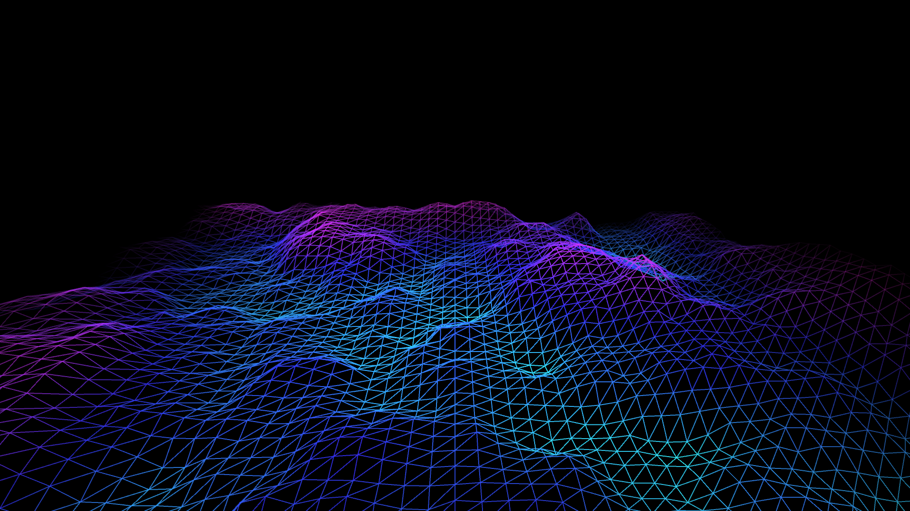

# fractal_brownian_motion_terrain

## Metadata
- **Date**: 2026-05-23
- **Theme**: A retro-futuristic 3D wireframe terrain driven by Perlin noise, creating the illusion of infinite fl
- **Technique**: Unknown
- **Logic Lab Reference**: 

## Concept
A retro-futuristic 3D wireframe terrain driven by Perlin noise, creating the illusion of infinite flight.

- **Date**: 2026-05-23
- **Theme**: Procedural generation, retro 3D graphics, outrun/synthwave aesthetics, terrain mapping.
- **Technique**: Utilizing `py5.begin_shape(py5.TRIANGLE_STRIP)`, we generate a 60x60 3D mesh grid. The vertical (Z) position of each vertex is determined by 2D Perlin noise (`py5.noise()`). To create the sensation of forward flight, the Y-coordinate sampled from the noise space is constantly offset downwards over time. The edges of the grid smoothly fade to black using a distance falloff mask. Rendered in P3D with dynamic neon HSB coloring mapped to altitude. 15s 60fps MP4.
- **Description**: The camera hurtles endlessly over a sprawling, mountainous digital landscape. The neon wireframe mountains shift colors from deep blue in the valleys to bright purple and pink at their peaks. As you fly forward, new mountains smoothly roll into existence from the black horizon, perfectly evoking the aesthetic of 1980s vector graphics and modern Synthwave art.

## Technical Details
- **Renderer**: P3D
- **Simulation**: Unknown
- **Visuals**: Unknown
- **Animation**: Contains animation details
