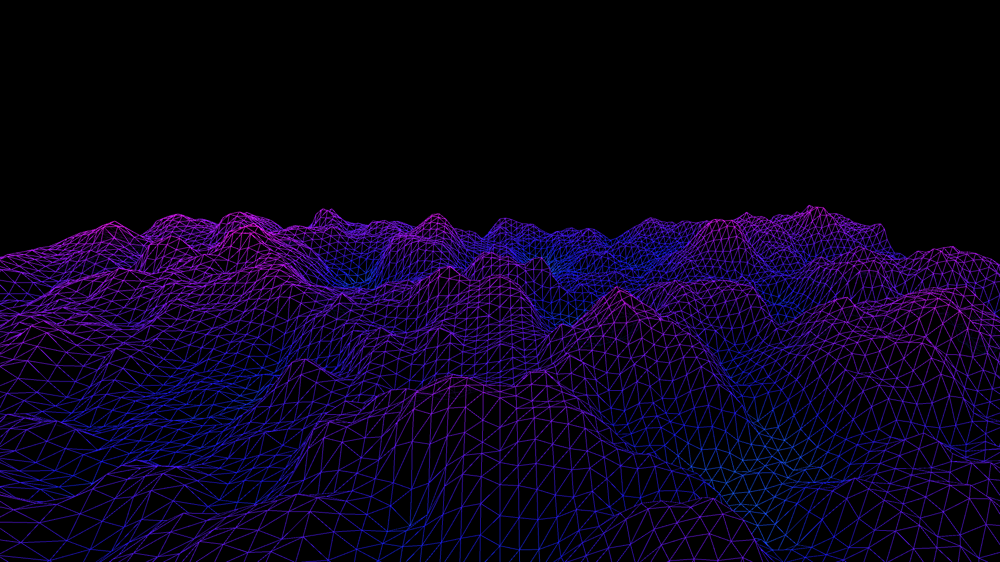

# fractal_brownian_terrain

## Metadata
- **Date**: 2026-05-23
- **Theme**: A sweeping 3D landscape generated by moving Fractional Brownian Motion (fBm) noise, projecting a neo
- **Technique**: Unknown
- **Logic Lab Reference**: 

## Concept
A sweeping 3D landscape generated by moving Fractional Brownian Motion (fBm) noise, projecting a neon-lit wireframe terrain that shifts and evolves as we fly over it in a dark void.

- **Theme**: A moving landscape generated by Fractional Brownian Motion (fBm) noise.
- **Technique**: 2.5D rendering using py5's P3D mode, moving noise grid using `py5.noise()`, mapping noise to height. Additive blending with vibrant neon color transitions based on height (e.g. from deep magenta valleys to electric cyan peaks). 15s @ 60fps MP4.
- **Description**: An endless flight over a shimmering mathematical landscape. As the terrain flows beneath, the neon wireframe contours shift dynamically, illustrating the complex, fractal nature of continuous 2D noise translated into 3D heightmaps.

## Technical Details
- **Renderer**: P3D
- **Simulation**: Unknown
- **Visuals**: Unknown
- **Animation**: Contains animation details
