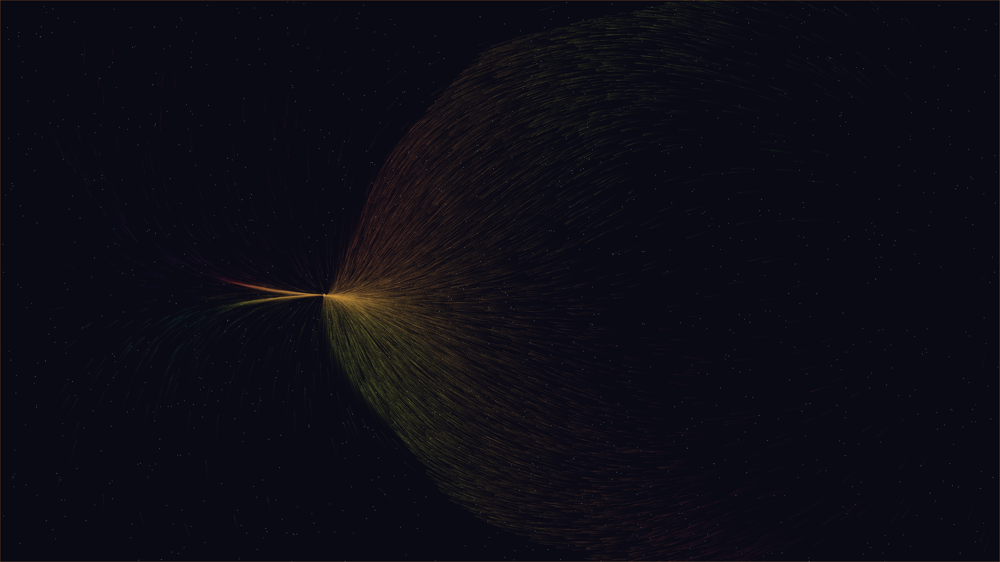

# fractal_currents

## Metadata
- **Date**: 2026-05-04
- **Theme**: Mathematical fluidity, fractal advection, complex dynamics, beautiful night sky
- **Technique**: Julia-set driven flow field, vectorized particle advection (NumPy), HSB phase-to-hue mapping, atmospheric starfield rendering

## Concept
A swirling, intricate sea of 40,000 particles flows along the complex-gradient of a Julia Set; the dense iridescent currents in electric teal and soft rose navigate the infinite recursive boundaries of the fractal against a deep star-dusted night sky.

## Technical Details
- **Renderer**: P2D
- **Simulation**: Julia-set driven flow field
- **Visuals**: vectorized particle advection (NumPy), HSB phase-to-hue mapping, atmospheric starfield rendering
- **Animation**: 10s @ 60fps (typical)
