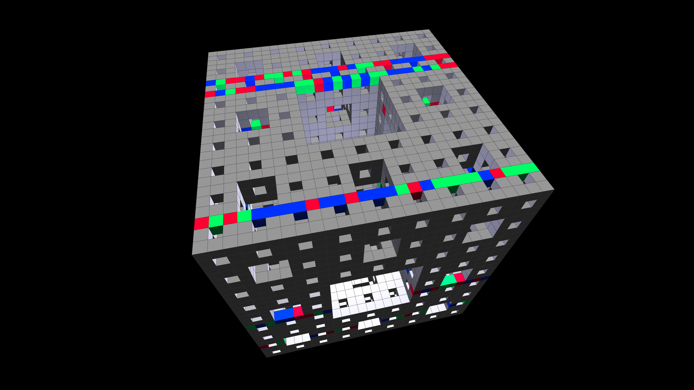

# fractal_menger_sponge_hyper_glitch_3d

## Metadata
- **Date**: 2026-06-14
- **Theme**: An animated 15s sequence showing a stark concrete Menger sponge tearing apart into jagged RGB shards
- **Technique**: Recursive 3D drawing of boxes to form a level-3 Menger sponge. At deeper recursion levels, the boxes' positions and rotations are aggressively displaced, and their colors shifted (chromatic aberration), based on a high-frequency, jittery temporal noise function.
- **Logic Lab Reference**: 

## Concept
An animated 15s sequence showing a stark concrete Menger sponge tearing apart into jagged RGB shards.

## Technical Details
- **Renderer**: Unknown
- **Simulation**: Unknown
- **Visuals**: Unknown
- **Animation**: Unknown
