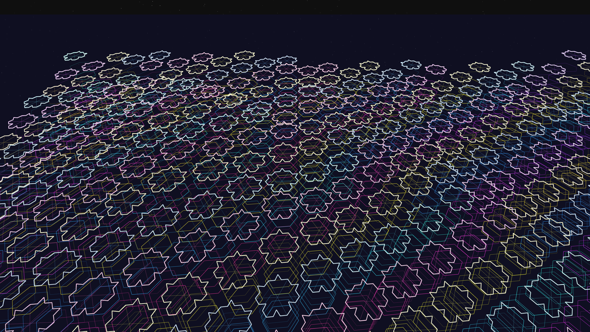

# fractal_metropolis

A sprawling, glowing metropolis of fractal monoliths extending into a deep-space void.

## Concept

This work explores the intersection of fractal urbanism and data metabolism. It reimagines a city as a living, recursive infrastructure where every building is a monolithic energy conduit that subdivides and pulses with light.

## Technique

- **Deformed Hexagonal Lattice**: The underlying grid is a hexagonal tiling that is dynamically warped by sinusoidal "data-winds," simulating a city under pressure.
- **Koch-Polygon Architecture**: Each monolith is capped with a Koch fractal perimeter that pulses between flat and recursive states.
- **Spectral Edge-Glow**: The structures are rendered with high-contrast spectral colors (Cyan, Magenta, Gold) and layered alpha glows to create a high-tech atmosphere.
- **Cosmic Scale**: A multi-scale starfield and horizon haze provide a sense of infinite atmospheric depth.

## Logic Lab Reference

- `tiling_patterns/ih02_tv08_koch/ih02_tv08_koch.py`: Adapted the deformed hex lattice and Koch point generation for 3D architectural rendering.

## Preview

