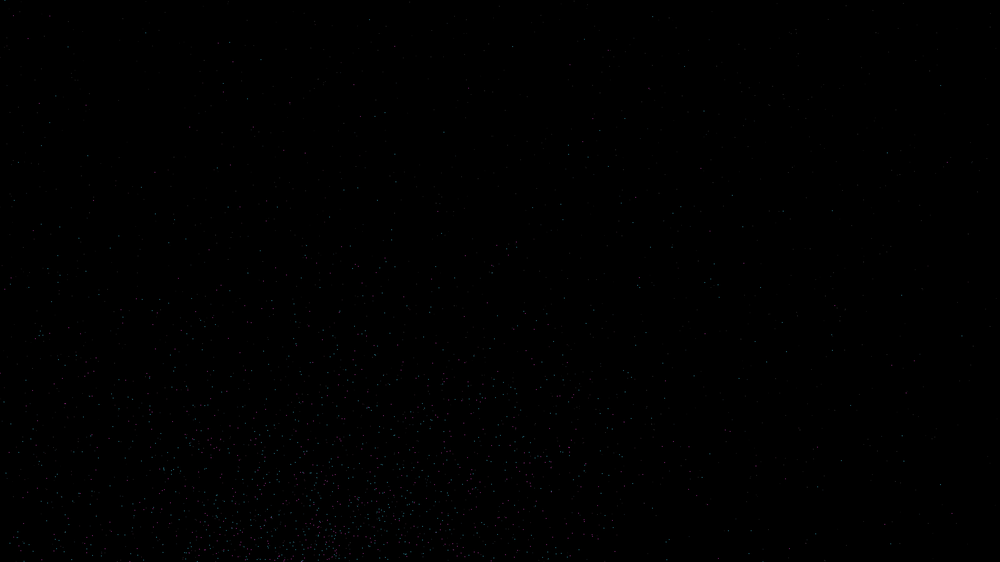

# galactic_collision

## Metadata
- **Date**: 2026-05-06
- **Theme**: Galactic collision, tidal tails, galactic cannibalism, beautiful night sky.
- **Technique**: N-body particle simulation (120,000 particles) using vectorized NumPy gravity (softened kernel). Two initial spiral distributions with distinct angular momenta and rotation axes. Features "tidal tail" formation, star clumping, and a high-density starfield background. Multi-pass rendering for central bulge glow using additive blending. 60fps high-bitrate MP4 encoding.
- **Logic Lab Reference**: None

## Concept
A massive, slow-motion cosmic dance where two spiral galaxies tear each other apart, leaving long, shimmering filaments of stars across the obsidian void; one galaxy glows in electric cyan while the other burns in royal amethyst, their cores merging into a white-gold brilliance against the silent star-dusted night.

## Technical Details
- **Renderer**: P3D
- **Simulation**: Vectorized NumPy, NumPy, particle.
- **Visuals**: additive blending, HSB spectral mapping, bloom-like highlights, prismatic color, dark-field contrast.
- **Animation**: 10 seconds at 60fps
