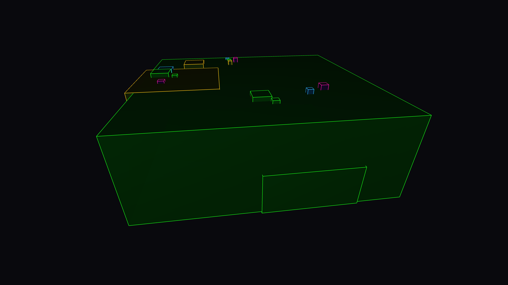

# gasket_metropolis

## Metadata
- **Date**: 2026-05-05
- **Theme**: Fractal urbanism, infinite density, modern city feel, beautiful night sky
- **Technique**: Recursive circle subdivision, 3D isometric building extrusion (P3D), Curvature-based height modulation, Neon spectral lighting

## Concept
A dense, shimmering metropolis of circular skyscrapers that recedes into infinite fractal detail; the buildings glow with electric blue and laser pink neon highlights, creating a vibrant geometric landscape under a silent, star-dusted midnight sky.

## Technical Details
- **Renderer**: P3D
- **Simulation**: Recursive circle subdivision
- **Visuals**: 3D isometric building extrusion (P3D), Curvature-based height modulation, Neon spectral lighting
- **Animation**: 10s @ 60fps (typical)
