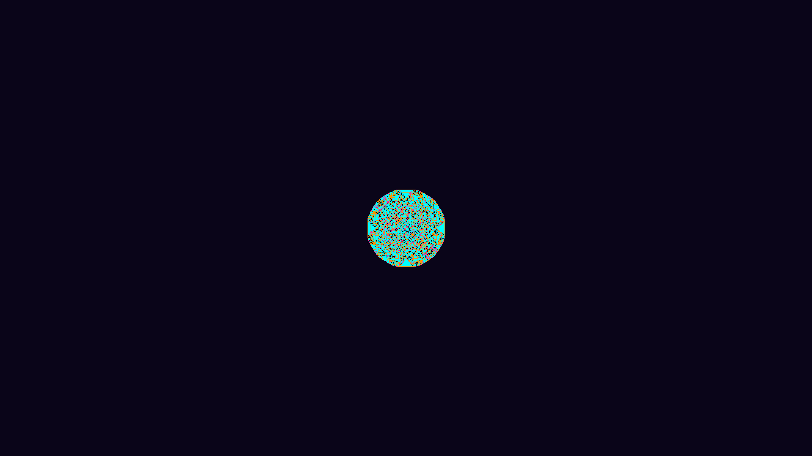

# generative_abelian_sandpile_fractal_2d

## Metadata
- **Date**: 2026-06-28
- **Theme**: The Abelian Sandpile Model produces incredibly intricate, Persian-rug-like fractal patterns
- **Technique**: Because toppling cascades can easily take billions of iterations in Python, this sketch completely vectorizes the logic using 2D NumPy array masks and `np.roll` shifts. The simulation runs 250 topple steps per frame. Over 15 seconds, millions of sand grains are dropped into the center, generating a spectacular expanding fractal mapped to a neon color palette.
- **Logic Lab Reference**: 

## Concept
The Abelian Sandpile Model produces incredibly intricate, Persian-rug-like fractal patterns. When a massive number of virtual "sand grains" are dropped into the center of a grid, any cell that accumulates 4 or more grains topples over, sending exactly 1 grain to each of its 4 cardinal neighbors. As the toppling cascades outward, complex, perfectly symmetrical geometric patterns naturally emerge.

## Technical Details
- **Renderer**: Unknown
- **Simulation**: Unknown
- **Visuals**: Unknown
- **Animation**: Contains animation details
