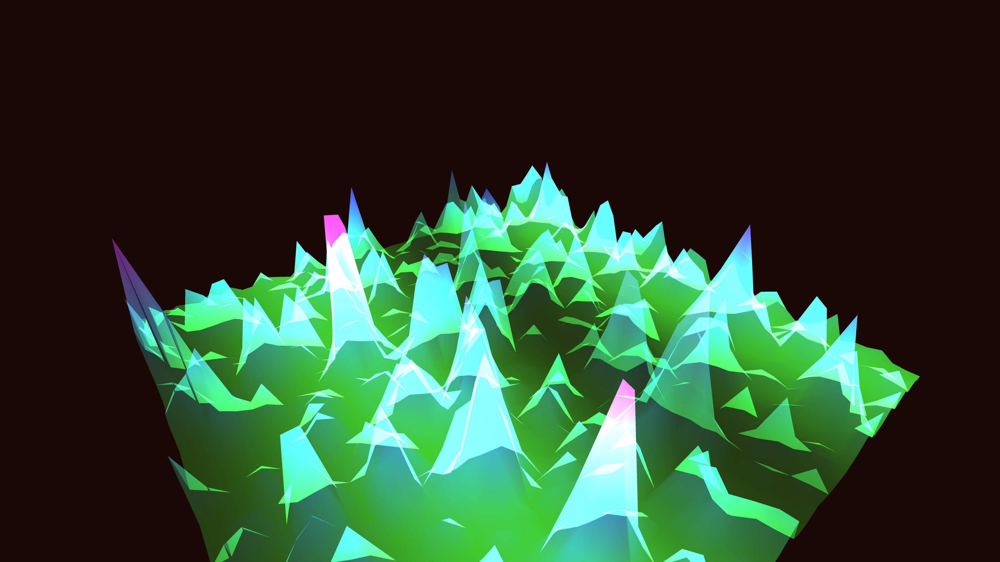

# generative_algorithmic_crystalline_aurora_3d

An animated 15s sequence of a generative 3D simulation of a crystalline terrain. The structures undulate and glow with the colors of an aurora borealis as invisible winds sweep over them.

- **Theme**: A 3D landscape of crystalline structures that undulate and glow with the colors of an aurora borealis as invisible winds sweep over them.
- **Technique**: A 3D mesh grid (terrain) displaced by moving Perlin noise. The vertices are drawn as translucent triangles. The color of each vertex depends on its height and the noise value, creating sweeping bands of green, cyan, and purple that resemble the northern lights.

