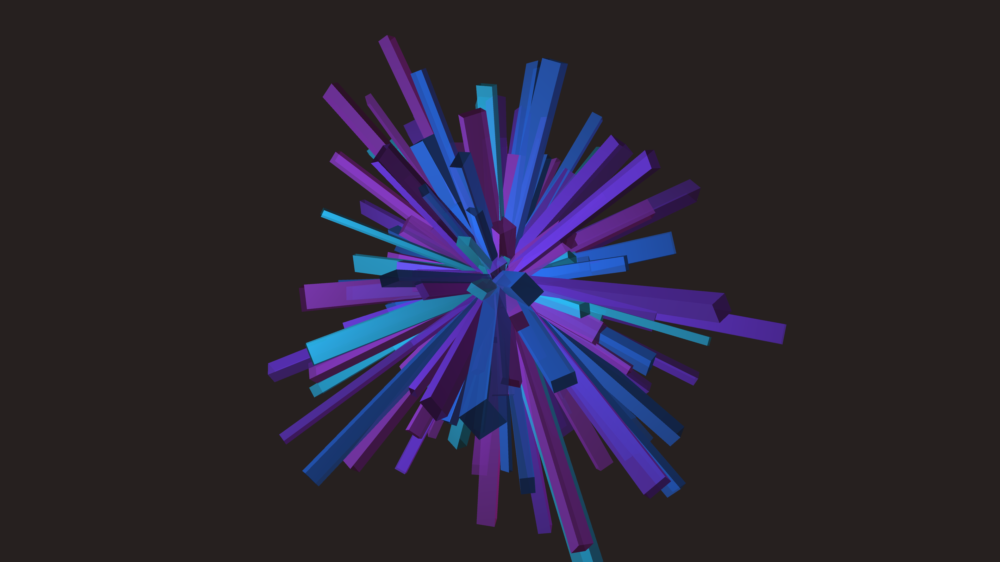

# generative_algorithmic_crystalline_growth_3d

An animated 15s sequence of a cluster of jagged 3D crystals growing and rotating.

- **Theme**: A cluster of jagged 3D crystals growing and rotating.
- **Technique**: Generates a random array of 3D box shapes, stretched along the Y-axis. Uses scaling with an easing function on the frame count so they appear to sprout out from the center over time. Adds point lights to give it a sharp, shiny 3D look.

