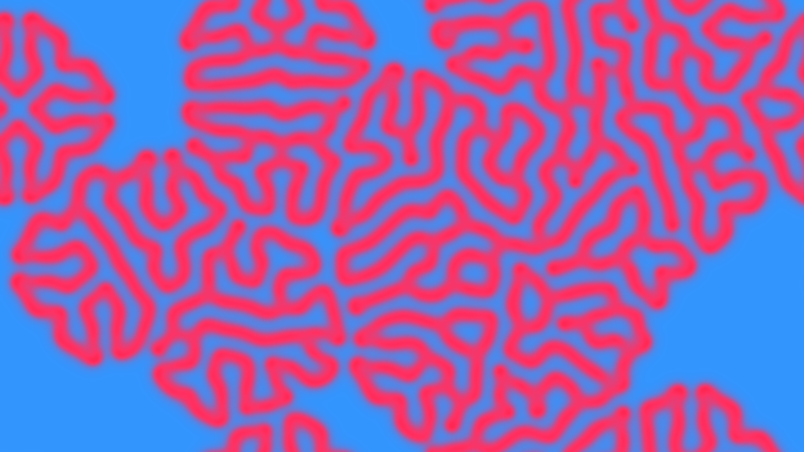

# generative_algorithmic_diffuse_reaction_reaction_diffusion_2d

An animated 15s sequence of a reaction diffusion simulation using Gray-Scott model, simulating the complex patterns of biological morphogenesis (like animal stripes and spots).

- **Theme**: Reaction diffusion simulation using Gray-Scott model, simulating the complex patterns of biological morphogenesis (like animal stripes and spots).
- **Technique**: Implements a Gray-Scott Reaction-Diffusion system on a 2D grid using numpy arrays and Laplacian convolution approximations. Scaled up and mapped to RGB channels to create fluid, cell-like organic patterns that split and merge.

