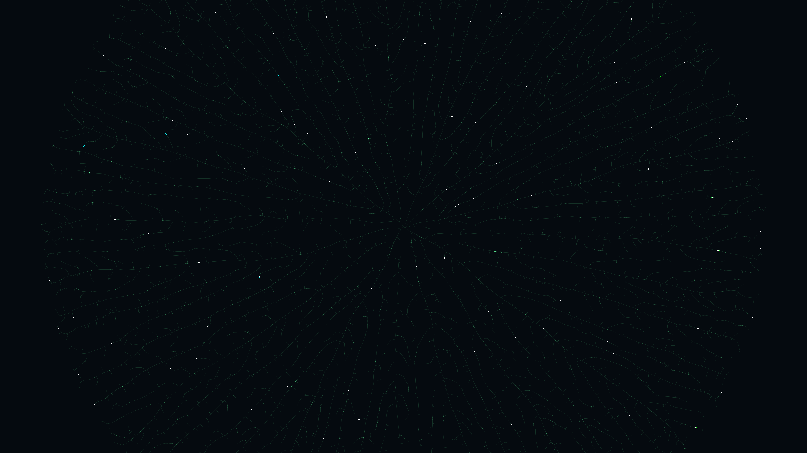

# generative_algorithmic_fractal_tree_roots_2d

## Metadata
- **Date**: 2026-06-29
- **Theme**: A massive network of organic roots or lightning branches expanding outward across the canvas, search
- **Technique**: Unknown
- **Logic Lab Reference**: 

## Concept
A massive network of organic roots or lightning branches expanding outward across the canvas, searching for connection points using a continuous space colonization algorithm.

## Technical Details
- **Renderer**: Unknown
- **Simulation**: Unknown
- **Visuals**: Unknown
- **Animation**: - `generative_algorithmic_fractal_tree_roots_2d.mp4` - `generative_algorithmic_fractal_tree_roots_2d_p1.png`
