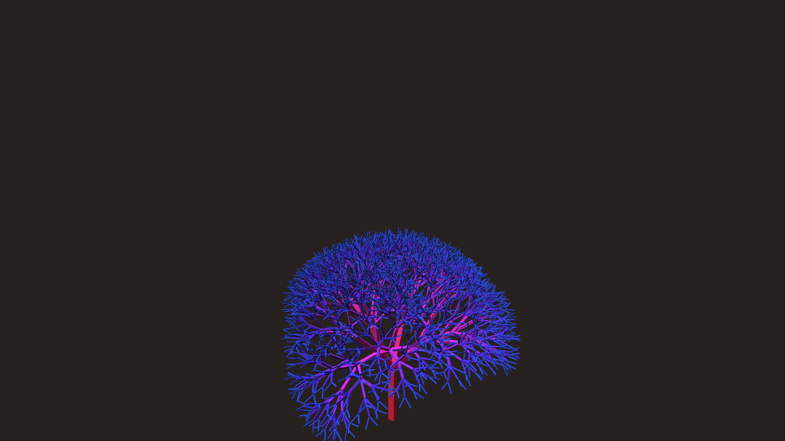

# generative_algorithmic_geometric_fractal_tree_3d

## Metadata
- **Date**: 2026-06-21
- **Theme**: An animated 15s sequence of a 3D fractal tree that grows and sways in the wind, made out of simple g
- **Technique**: Unknown
- **Logic Lab Reference**: 

## Concept
An animated 15s sequence of a 3D fractal tree that grows and sways in the wind, made out of simple geometric primitives (boxes) that change color based on depth.

- **Theme**: A 3D fractal tree that grows and sways in the wind, made out of simple geometric primitives (boxes or cylinders) that change color based on depth.
- **Technique**: Uses a recursive function `branch(depth, length)` to draw a 3D tree. Applies `rotate_z(sin(time + depth))` at each level to create a swaying effect. Uses `py5.box()` for branches and varies color based on recursion depth.

## Technical Details
- **Renderer**: Unknown
- **Simulation**: Unknown
- **Visuals**: Unknown
- **Animation**: Unknown
