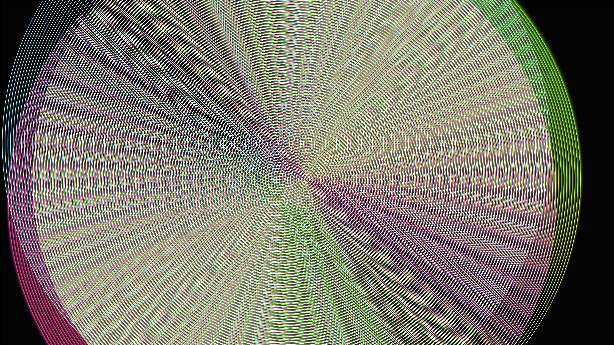

# generative_algorithmic_geometric_interference_2d

## Metadata
- **Date**: 2026-06-25
- **Theme**: - **Date**: 2026-06-24 - **Theme**: Complex geometric interference patterns created by overlapping, 
- **Technique**: Unknown
- **Logic Lab Reference**: 

## Concept
- **Date**: 2026-06-24
- **Theme**: Complex geometric interference patterns created by overlapping, spinning moire circles.
- **Technique**: Multiple concentric circle sets (moire patterns) are drawn with varying radii and line counts. Their centers move according to distinct Lissajous curves (sine and cosine waves with different frequencies). As the glowing neon lines overlap, additive blending generates vibrant, hypnotic interference patterns.
- **Description**: An animated sequence of a generative geometric interference simulation.

## Technical Details
- **Renderer**: Unknown
- **Simulation**: Unknown
- **Visuals**: Unknown
- **Animation**: Unknown
