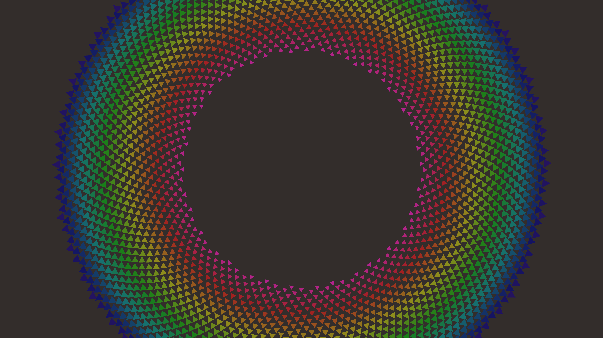

# generative_algorithmic_geometric_spiral_phyllotaxis_2d

## Metadata
- **Date**: 2026-06-21
- **Theme**: An animated 15s sequence of a 2D animation based on the phyllotaxis pattern (sunflower seed arrangem
- **Technique**: Unknown
- **Logic Lab Reference**: 

## Concept
An animated 15s sequence of a 2D animation based on the phyllotaxis pattern (sunflower seed arrangement), but using animated, rotating, glowing geometric shapes (like triangles) instead of simple dots. The pattern spirals outwards infinitely.

- **Theme**: A 2D animation based on the phyllotaxis pattern (sunflower seed arrangement), but using animated, rotating, glowing geometric shapes (like triangles) instead of simple dots. The pattern spirals outwards infinitely.
- **Technique**: Generates positions using `r = c * sqrt(n)` and `theta = n * 137.5 degrees`. Each frame, offsets the `n` values to make it look like it's spiraling outward continuously. Draws rotating triangles whose size and brightness decrease outwards.

## Technical Details
- **Renderer**: Unknown
- **Simulation**: Unknown
- **Visuals**: Unknown
- **Animation**: Unknown
