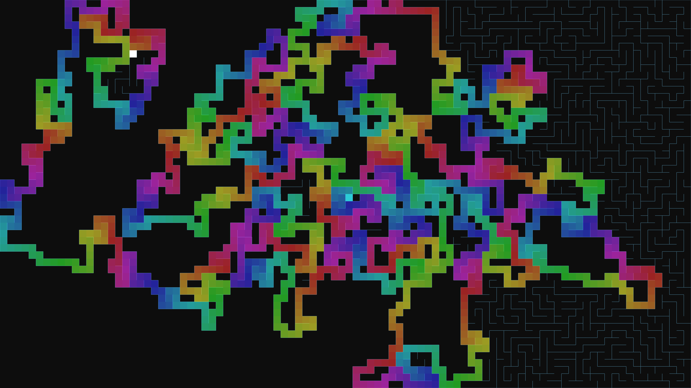

# generative_algorithmic_maze_depth_first_search_2d

An animated 15s sequence of a generative maze that builds itself using a randomized depth-first search algorithm. As the algorithm explores, the current path glows brightly and leaves a trail of walls behind.

- **Theme**: A generative maze that builds itself using a randomized depth-first search algorithm. As the algorithm explores, the current path glows brightly and leaves a trail of walls behind.
- **Technique**: Implements depth-first search on a grid. The algorithm maintains a stack of cells and processes multiple steps per frame for speed. The current stack is drawn with glowing colors, and finalized cells are drawn as walls. Includes a motion blur effect for visual flair.

