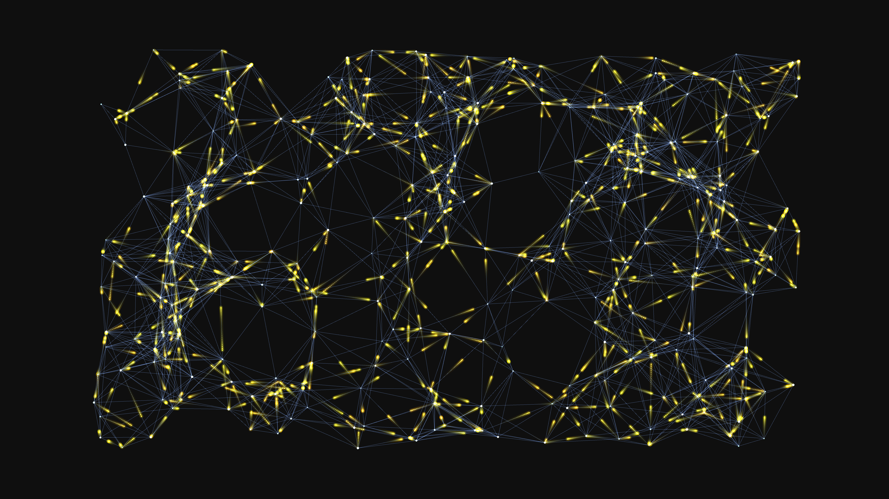

# generative_algorithmic_neural_network_sparks_2d

## Metadata
- **Date**: 2026-06-21
- **Theme**: An animated 15s sequence of a generative 2D simulation of a dense neural network
- **Technique**: Unknown
- **Logic Lab Reference**: 

## Concept
An animated 15s sequence of a generative 2D simulation of a dense neural network. Nodes pulse with energy and send electric sparks along the synapses to connected nodes, creating cascading waves of light.

- **Theme**: A 2D visualization of a dense neural network. Nodes pulse with energy and send electric sparks along the synapses to connected nodes, creating cascading waves of light.
- **Technique**: A graph of nodes spread randomly across the screen. Lines are drawn between nearby nodes. A particle system generates "sparks" that travel along the edges from node to node. Additive blending makes the high-traffic nodes glow brightly.

## Technical Details
- **Renderer**: Unknown
- **Simulation**: Unknown
- **Visuals**: Unknown
- **Animation**: Unknown
