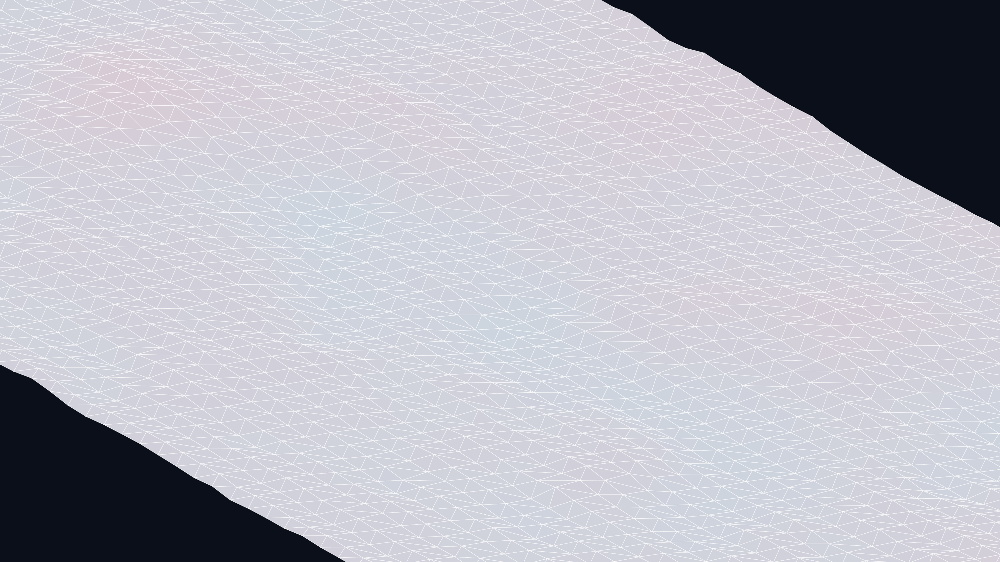

# generative_algorithmic_origami_tessellation_2d

## Metadata
- **Date**: 2026-06-29
- **Theme**: A continuous unfolding and folding of geometric shapes that mimic a massive, breathing origami tesse
- **Technique**: Unknown
- **Logic Lab Reference**: 

## Concept
A continuous unfolding and folding of geometric shapes that mimic a massive, breathing origami tessellation, undulating like a landscape.

## Technical Details
- **Renderer**: Unknown
- **Simulation**: Unknown
- **Visuals**: Unknown
- **Animation**: - `generative_algorithmic_origami_tessellation_2d.mp4` - `generative_algorithmic_origami_tessellation_2d_p1.png`
