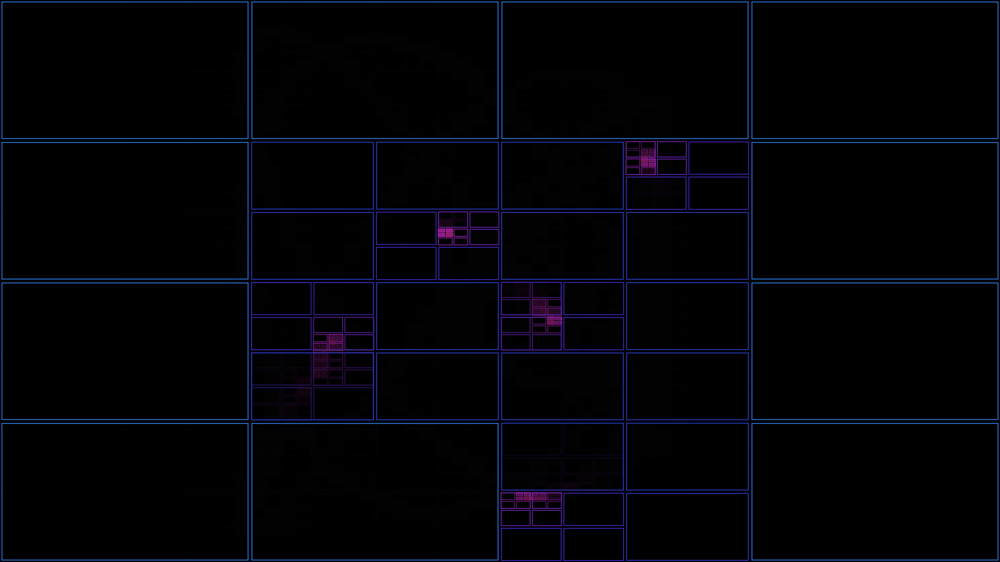

# generative_algorithmic_quadtree_subdivision_2d

## Metadata
- **Date**: 2026-06-25
- **Theme**: - **Theme**: A recursive spatial subdivision (quadtree) that dynamically splits and merges based on 
- **Technique**: Unknown
- **Logic Lab Reference**: 

## Concept
- **Theme**: A recursive spatial subdivision (quadtree) that dynamically splits and merges based on the motion of invisible attractors.
- **Technique**: 2D Quadtree algorithm. It recursively divides rectangles if an attractor is within bounds. The rectangles are drawn as glowing neon wireframes that flash as they subdivide.
- **Palette**: Deep black background, with electric blue and magenta strokes highlighting the depth of subdivision.

## Technical Details
- **Renderer**: Unknown
- **Simulation**: Unknown
- **Visuals**: Unknown
- **Animation**: Unknown
