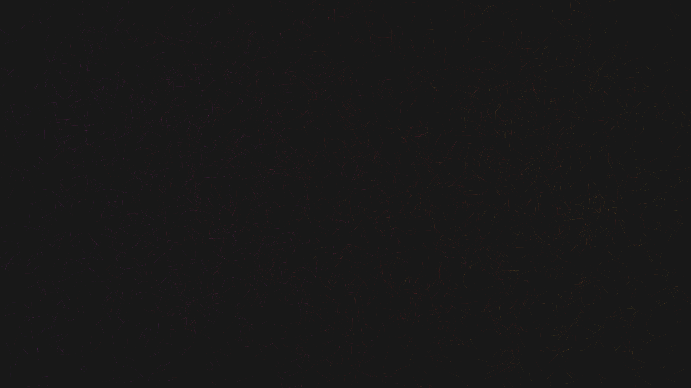

# generative_algorithmic_silk_strands_2d

An animated 15s sequence of delicate, luminous strands of silk blowing in a virtual wind. They interweave and layer on top of each other, forming complex, undulating abstract fabrics that glow softly against a dark background.

- **Theme**: Delicate, luminous strands of silk blowing in a virtual wind. They interweave and layer on top of each other, forming complex, undulating abstract fabrics that glow softly against a dark background.
- **Technique**: A large number of particles trace paths across the screen. The angle of each particle is driven by a 3D noise field where time is the Z-axis, creating coherent, flowing wind patterns. Additive blending and very low opacity create the glowing, layered silk effect.

