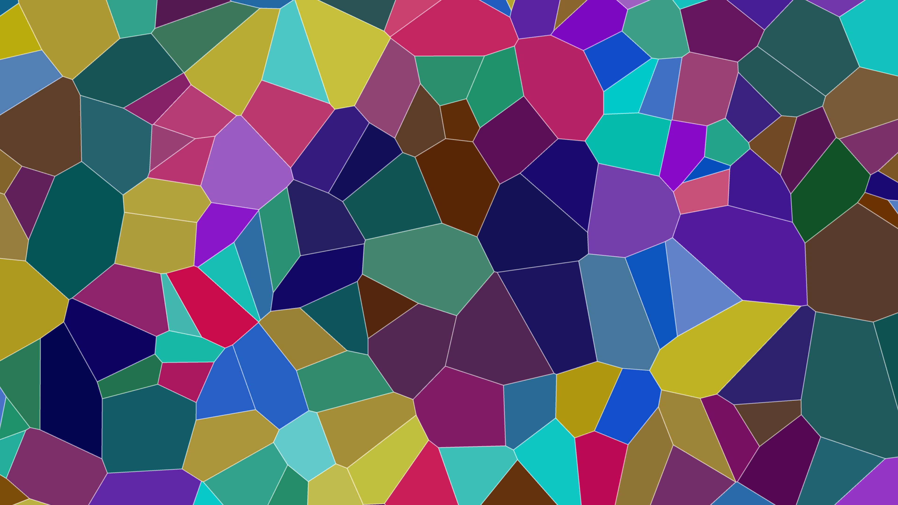

# generative_algorithmic_voronoi_crystal_shatter_2d

An animated 15s sequence of a shattered crystal effect using a moving Voronoi diagram. The cell seeds move around slowly, and each polygonal cell is colored with vibrant jewel tones.

- **Theme**: A shattered crystal effect using a moving Voronoi diagram. The cell seeds move around slowly, and each polygonal cell is colored with vibrant jewel tones.
- **Technique**: Uses `scipy.spatial.Voronoi` to compute polygons for moving points. Calculates the centroid of each polygon to pulse brightness based on a sine wave propagating from the center, creating a shimmering glass/crystal effect.

