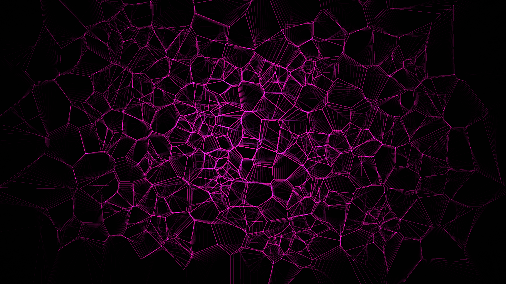

# generative_algorithmic_voronoi_shatter_2d

## Metadata
- **Date**: 2026-06-25
- **Theme**: - **Theme**: A geometric field fracturing into a Voronoi diagram that dynamically shifts over time
- **Technique**: Unknown
- **Logic Lab Reference**: 

## Concept
- **Theme**: A geometric field fracturing into a Voronoi diagram that dynamically shifts over time.
- **Technique**: Uses `scipy.spatial.Voronoi` applied to an array of points that wander using Perlin noise. The cells are rendered with additive blending, and the stroke weight of the fracture edges depends on their distance to the center.
- **Palette**: Dark monochromatic void with neon pink glowing fracture edges.

## Technical Details
- **Renderer**: Unknown
- **Simulation**: Unknown
- **Visuals**: Unknown
- **Animation**: Unknown
