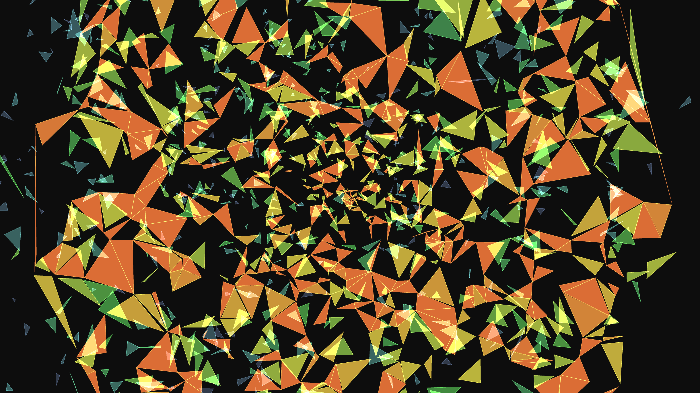

# generative_apoptosis_fragmentation_2d

## Metadata
- **Date**: 2026-06-20
- **Theme**: Simulating programmed cell death (apoptosis) where a large structured cell slowly fragments into sma
- **Technique**: A 2D Delaunay triangulation is used to generate a unified, connected mesh of biological "cells" clustered in the center of the canvas. Over the 10-second duration, a noise-driven wave of "apoptosis" washes over the structure. As individual fragments die, their color shifts from warm oranges/reds to cool, dim blues. The fragments detach, shrink, and drift apart, rotating organically to simulate the breakdown of a large cellular structure into isolated apoptotic bodies.
- **Logic Lab Reference**: 

## Concept
Simulating programmed cell death (apoptosis) where a large structured cell slowly fragments into smaller apoptotic bodies (inspired by GO:0006915 - apoptotic process).

## Technical Details
- **Renderer**: Unknown
- **Simulation**: Unknown
- **Visuals**: Unknown
- **Animation**: Contains animation details
