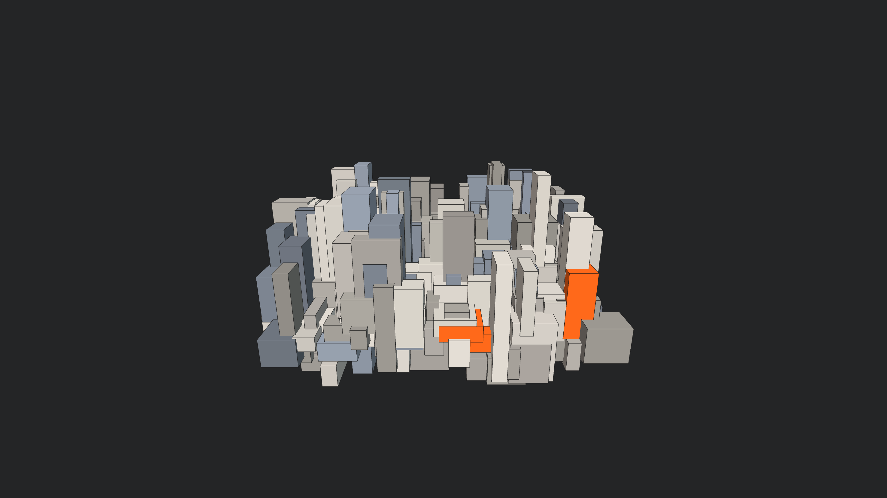

# generative_architectural_brutalism_3d

## Metadata
- **Date**: 2026-06-22
- **Theme**: Generative Art
- **Technique**: 3D recursive boxes with sharp directional lighting, simulating ambient occlusion and cast shadows on moving brutalist forms. An orbiting camera slowly reveals the imposing scale of the structure as the blocks animate up and down according to shifting sine wave phases.
- **Logic Lab Reference**: 

## Concept
No concept description provided.

## Technical Details
- **Renderer**: Unknown
- **Simulation**: Unknown
- **Visuals**: Unknown
- **Animation**: Unknown
