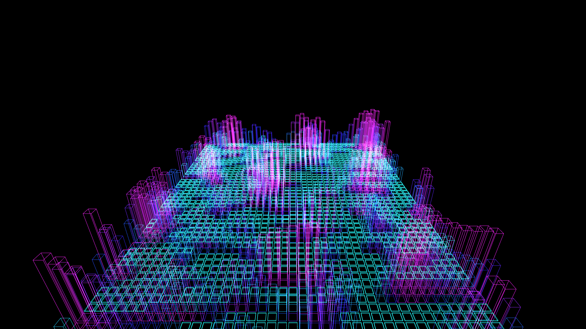

# generative_architectural_wireframe_city_3d

## Metadata
- **Date**: 2026-06-20
- **Theme**: A sweeping 3D camera flythrough over an endless abstract architectural cityscape composed of glowing
- **Technique**: Using a grid of `py5.box()` with `py5.no_fill()` and `py5.stroke()`. The heights are driven by `py5.os_noise`. As the camera moves forward, the city scrolls. Additive blending with deep cyan and magenta creates a retro-futuristic aesthetic.
- **Logic Lab Reference**: 

## Concept
A sweeping 3D camera flythrough over an endless abstract architectural cityscape composed of glowing geometric wireframes that slowly build themselves up from the ground.

## Technical Details
- **Renderer**: Unknown
- **Simulation**: Unknown
- **Visuals**: Unknown
- **Animation**: Contains animation details
