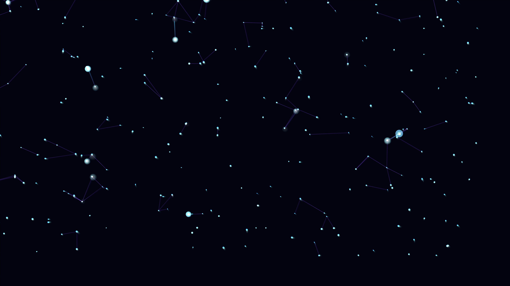

# generative_biological_neuron_synapse_flash_2d

## Metadata
- **Date**: 2026-06-24
- **Theme**: - **Date**: 2026-06-24 - **Theme**: A visualization of biological neural networks firing in 2D
- **Technique**: Unknown
- **Logic Lab Reference**: 

## Concept
- **Date**: 2026-06-24
- **Theme**: A visualization of biological neural networks firing in 2D. A branching dendrite structure where bright white synapse flashes travel along semi-transparent blue and purple pathways.
- **Technique**: An interconnected graph of nodes spread randomly across the screen. Lines are drawn between nearby nodes to form neural pathways. Pulses representing action potentials are randomly injected and travel along edges. When reaching a target node, it flashes brightly and has a chance to propagate the signal to connected edges. Additive blending is used on the pulses for intense luminance.
- **Description**: An animated sequence of generative biological neuron synapses firing.

## Technical Details
- **Renderer**: Unknown
- **Simulation**: Unknown
- **Visuals**: Unknown
- **Animation**: Unknown
