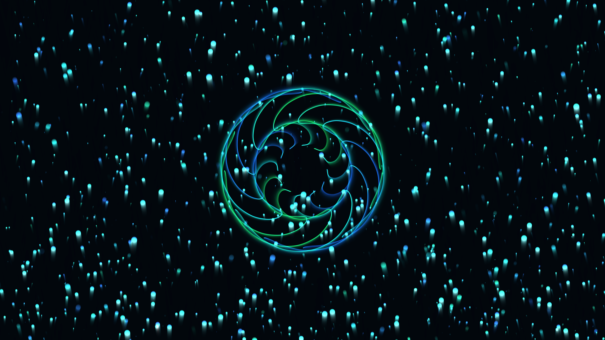

# generative_bioluminescent_deep_sea_snow_2d

## Metadata
- **Date**: 2026-06-27
- **Theme**: An animated sequence simulating a deep-sea descent through glowing "marine snow" particles and abstr
- **Technique**: Unknown
- **Logic Lab Reference**: 

## Concept
An animated sequence simulating a deep-sea descent through glowing "marine snow" particles and abstract bioluminescent organisms. The composition uses a 2D canvas with mathematically scaled particles to simulate depth and parallax, avoiding macOS OpenGL issues while achieving a lush, 3D volumetric feel through additive blending.

## Technical Details
- **Renderer**: Unknown
- **Simulation**: Unknown
- **Visuals**: Unknown
- **Animation**: 
