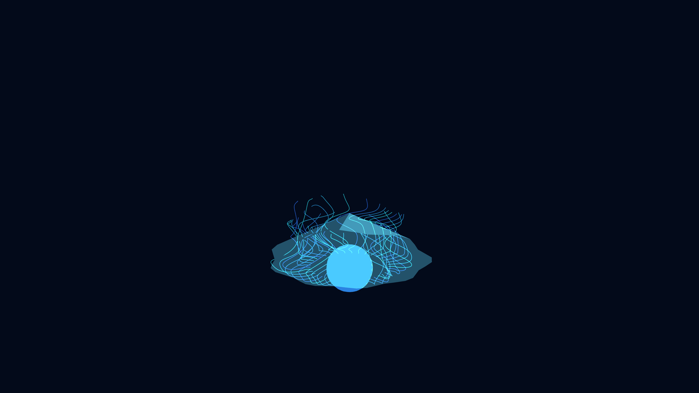

# generative_bioluminescent_jellyfish_umbrella_3d

An animated 15s sequence of a generative 3D simulation of a bioluminescent jellyfish. A glowing hemisphere pulses rhythmically to simulate swimming, trailing long splines that wave organically in the deep sea.

- **Theme**: A hypnotic, rhythmic pulsing motion of an abstract jellyfish bell and long trailing tentacles rendered with glowing, translucent geometries.
- **Technique**: 3D hemisphere modified by sine waves to create the pulsing swimming motion. Long trailing splines for tentacles using a history of positions with 3D noise adding organic waving. Additive blending in a dark background.

