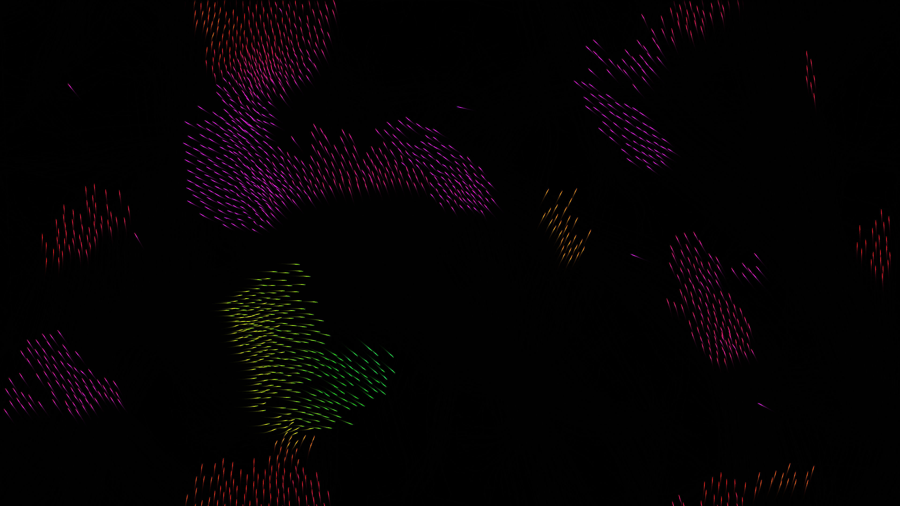

# generative_boids_flocking_behavior_2d

## Metadata
- **Date**: 2026-06-25
- **Theme**: - **Theme**: A swarm of boids mimicking flocking birds or schooling fish, leaving glowing trails as 
- **Technique**: Unknown
- **Logic Lab Reference**: 

## Concept
- **Theme**: A swarm of boids mimicking flocking birds or schooling fish, leaving glowing trails as they move across a dark void.
- **Technique**: Standard Boids algorithm (Separation, Alignment, Cohesion) vectorized with NumPy for performance. Rendered as glowing neon streaks on a 2D canvas with a fade effect to create trails.
- **Palette**: Neon Cyan, Purple, and Deep Blue on a black background, with color mapped dynamically to the velocity vector of each boid.

## Technical Details
- **Renderer**: Unknown
- **Simulation**: Unknown
- **Visuals**: Unknown
- **Animation**: Unknown
