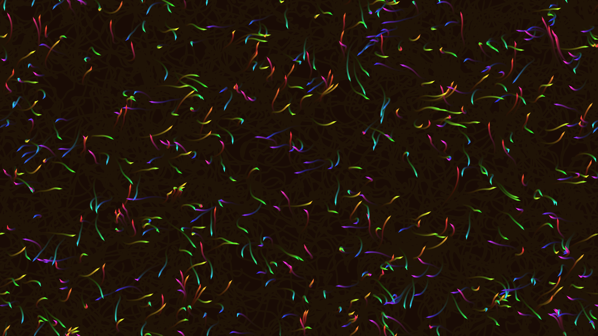

# generative_boids_flocking_simulation_2d

## Metadata
- **Date**: 2026-06-27
- **Theme**: Generative Art
- **Technique**: Uses a modified boids steering behavior algorithm optimized for Python execution speed. Rather than O(N^2) pairwise distance checks for alignment and cohesion, the boids are steered by a globally continuous 3D OpenSimplex noise field that mimics macroscopic group flow. The boids are drawn as oriented triangles that leave semi-transparent trails as they move.
- **Logic Lab Reference**: 

## Concept
No concept description provided.

## Technical Details
- **Renderer**: Unknown
- **Simulation**: Unknown
- **Visuals**: Unknown
- **Animation**: Unknown
