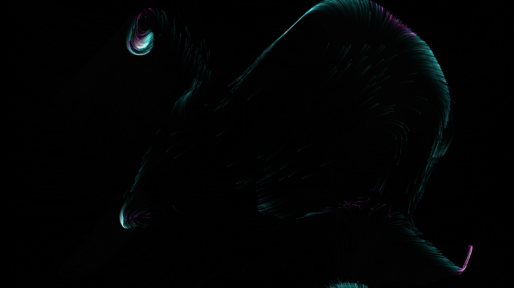

# generative_boids_flocking_swirl_2d

## Metadata
- **Date**: 2026-06-28
- **Theme**: A massive swarm of neon-colored geometric birds flowing through a fluid void, creating a continuous 
- **Technique**: An O(N) pseudo-flocking simulation implemented using highly optimized NumPy array operations. The 3,000 agents use a Perlin-noise-like flow field, a vortex attractor, and a moving Lissajous target to simulate complex flocking behavior without the heavy O(N^2) all-to-all collision checks. They are drawn using additive blending with distinct neon colors grouped by velocity buckets for maximum Python-to-Java bridge efficiency.
- **Logic Lab Reference**: 

## Concept
A massive swarm of neon-colored geometric birds flowing through a fluid void, creating a continuous vortex as they chase a moving target while avoiding chaotic wind forces.

## Technical Details
- **Renderer**: Unknown
- **Simulation**: Unknown
- **Visuals**: Unknown
- **Animation**: Contains animation details
