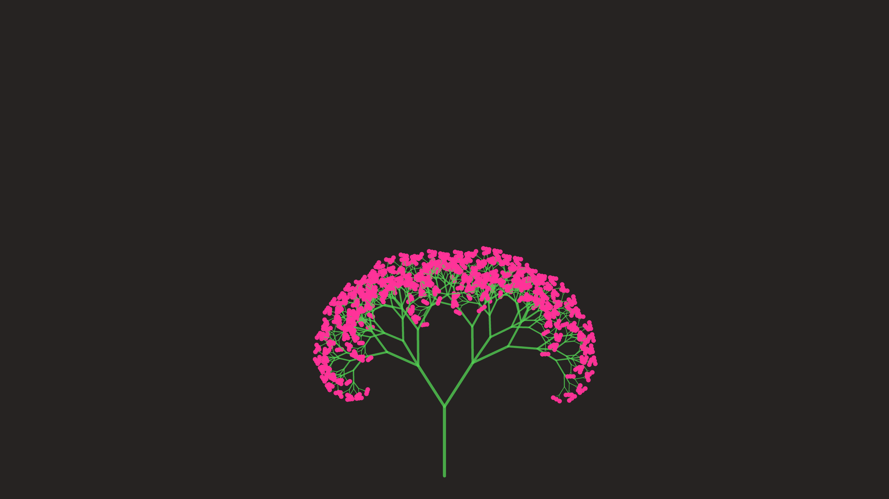

# generative_botanical_fractal_bloom_2d

## Metadata
- **Date**: 2026-06-21
- **Theme**: An animated 15s sequence of a delicate, intricate fractal plant that gracefully grows from the botto
- **Technique**: Unknown
- **Logic Lab Reference**: 

## Concept
An animated 15s sequence of a delicate, intricate fractal plant that gracefully grows from the bottom up, smoothly unfolding its branches and blossoming at its tips.

- **Theme**: A delicate, intricate fractal plant that gracefully grows from the bottom up, smoothly unfolding its branches and blossoming at its tips.
- **Technique**: Uses a recursive tree growth function where branches scale their length based on time elapsed relative to their depth in the tree. Uses a sine wave for wind sway. Blooms are drawn as additive glowing circles at the leaf nodes once they reach full growth.

## Technical Details
- **Renderer**: Unknown
- **Simulation**: Unknown
- **Visuals**: Unknown
- **Animation**: Unknown
