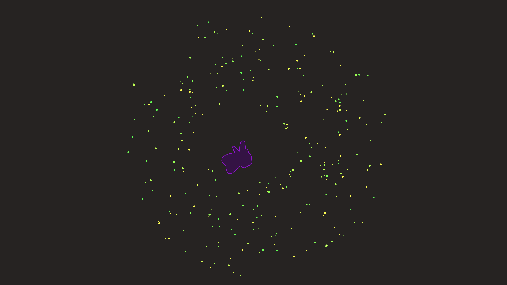

# generative_cellular_autophagy_2d

## Metadata
- **Date**: 2026-06-20
- **Theme**: An abstract cellular simulation inspired by autophagy (GO:0006914), where larger cellular bodies sys
- **Technique**: A soft-body physics simulation using noise-driven membranes and attraction forces. 'Macromolecular' yellow-green particles are pulled into and dissolved by a larger wandering central vacuole-like entity, diminishing their alpha and size upon being consumed.
- **Logic Lab Reference**: 

## Concept
An abstract cellular simulation inspired by autophagy (GO:0006914), where larger cellular bodies systematically digest smaller internal materials to remodel themselves.

## Technical Details
- **Renderer**: Unknown
- **Simulation**: Unknown
- **Visuals**: Unknown
- **Animation**: Contains animation details
