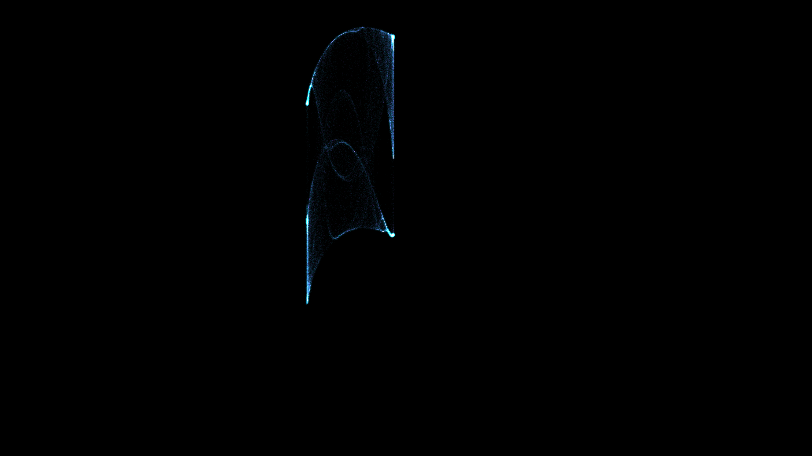

# generative_chaotic_strange_attractor_dust_2d

## Metadata
- **Date**: 2026-06-28
- **Theme**: A billion glowing particles mapped over time by a Peter de Jong strange attractor, creating slowly m
- **Technique**: Utilizing NumPy vectorization to calculate the attractor equations for 150,000 points per frame simultaneously. Rendered with additive blending, deep violet and cosmic magenta colors to create a dense, celestial effect. The continuous parameter drifting relies on 4 overlapping sine and cosine waves driving the (a, b, c, d) constants of the chaotic formula.
- **Logic Lab Reference**: 

## Concept
A billion glowing particles mapped over time by a Peter de Jong strange attractor, creating slowly morphing nebula-like dust clouds as the chaotic parameters continuously drift.

## Technical Details
- **Renderer**: Unknown
- **Simulation**: Unknown
- **Visuals**: Unknown
- **Animation**: Contains animation details
