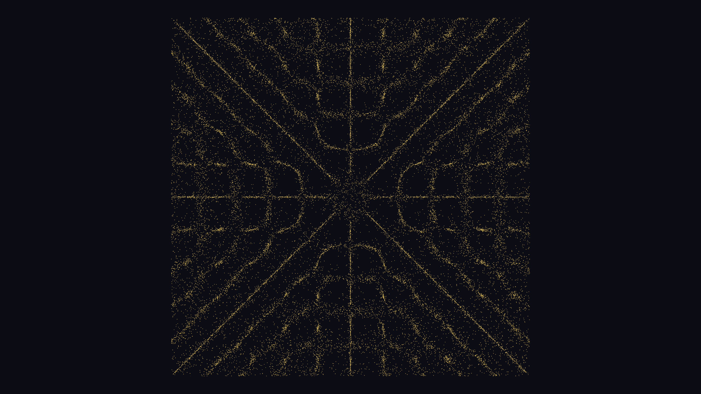

# generative_chladni_cymatics_resonance_2d

## Metadata
- **Date**: 2026-06-17
- **Theme**: A 2D simulation of Chladni figures—patterns formed by sand on a vibrating metal plate—evolving over 
- **Technique**: Uses 30,000 particles whose velocities are influenced by a 2D scalar field representing acoustic standing waves (the Chladni equation for a square plate). Particles migrate towards the nodes (areas of zero vibration). The frequencies ($n$ and $m$) slowly sweep over time, causing the particles to transition organically into new symmetric mandala-like patterns.
- **Logic Lab Reference**: 

## Concept
A 2D simulation of Chladni figures—patterns formed by sand on a vibrating metal plate—evolving over time as the resonant frequencies change.

## Technical Details
- **Renderer**: Unknown
- **Simulation**: Unknown
- **Visuals**: Unknown
- **Animation**: Unknown
