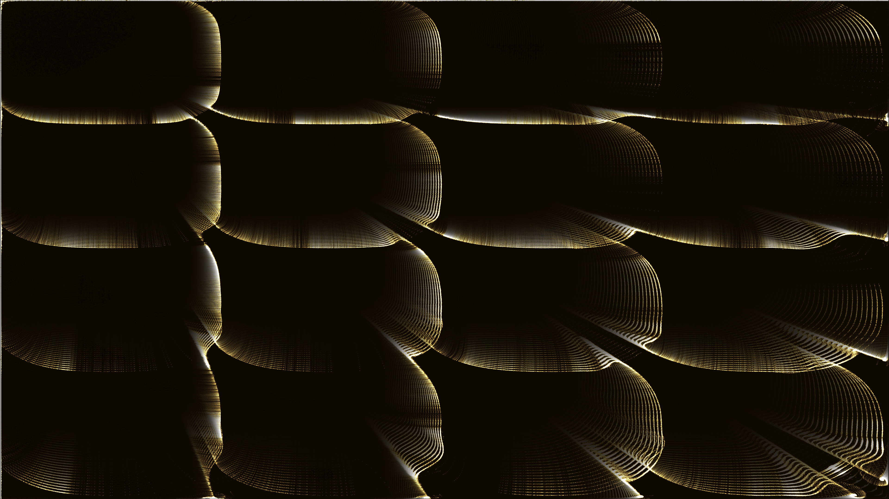

# generative_chladni_plate_cymatics_2d

## Metadata
- **Date**: 2026-06-28
- **Theme**: A generative simulation of Chladni plate cymatics, where fine golden sand particles organize into co
- **Technique**: Evaluating the gradient of the mathematical Chladni function `Z = sin(n*pi*x)*sin(m*pi*y) + sin(m*pi*x)*sin(n*pi*y)` across a massive array of 150,000 points. The particles are driven toward the nodal lines (where Z = 0) to form the patterns. As the N and M frequencies slowly shift via continuous sine/cosine waves, the patterns elegantly restructure themselves in real time.
- **Logic Lab Reference**: 

## Concept
A generative simulation of Chladni plate cymatics, where fine golden sand particles organize into complex, symmetrical interference patterns on a vibrating metal plate driven by pure resonant sonic frequencies.

## Technical Details
- **Renderer**: Unknown
- **Simulation**: Unknown
- **Visuals**: Unknown
- **Animation**: Contains animation details
