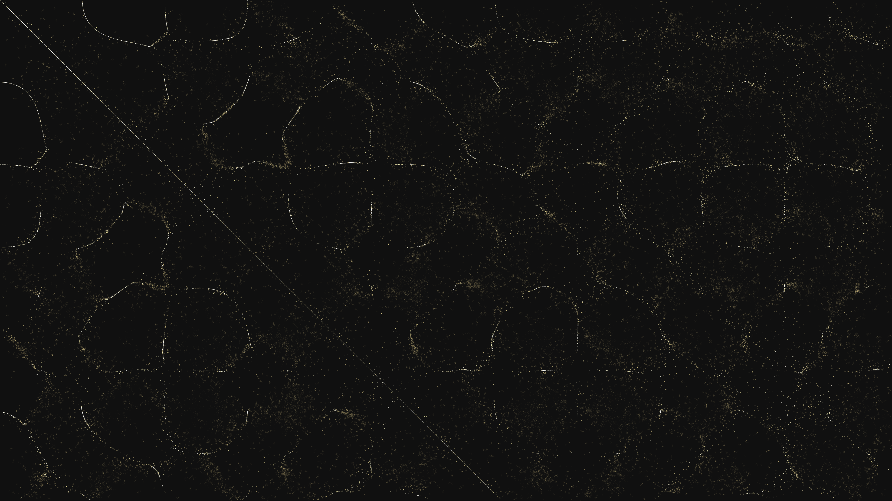

# generative_chladni_plate_resonance_2d

An abstract visualization of Chladni figures—patterns formed by fine sand on a vibrating plate. As the simulated frequencies smoothly shift, thousands of particles flow away from areas of intense vibration to settle along the nodal lines (areas of zero vibration), forming intricate, evolving geometric shapes.

## Technical Details

- **Language**: Python + py5
- **Format**: Animation (15s @ 60fps)
- **Renderer**: 2D

## Output

