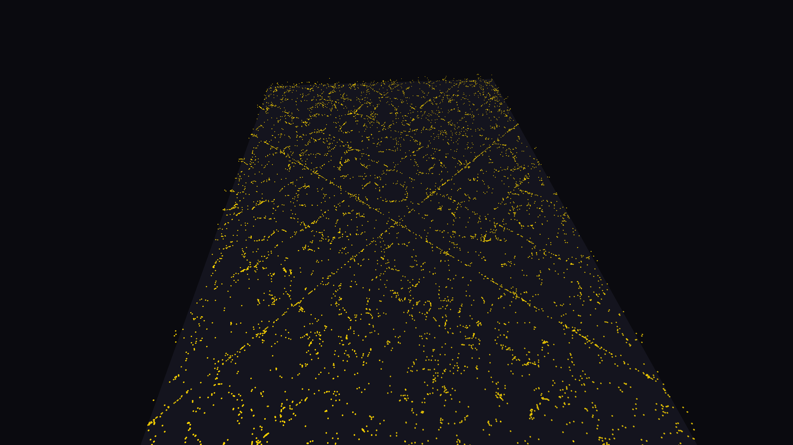

# generative_chladni_plate_resonance_3d

## Metadata
- **Date**: 2026-06-20
- **Theme**: 3D simulation of sand particles organizing into complex Chladni resonance patterns on a vibrating me
- **Technique**: A 3D physics approximation where 10,000 particles fall and bounce towards the nodes of a dynamic 2D interference standing wave equation, mapped into 3D space with a slowly rotating camera. Rendered as tiny golden spheres.
- **Logic Lab Reference**: 

## Concept
3D simulation of sand particles organizing into complex Chladni resonance patterns on a vibrating metal plate.

## Technical Details
- **Renderer**: Unknown
- **Simulation**: Unknown
- **Visuals**: Unknown
- **Animation**: Contains animation details
