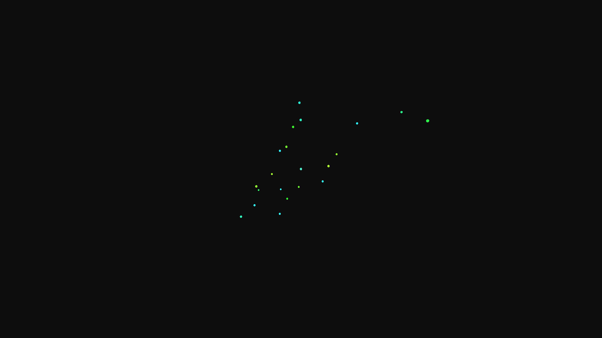

# generative_chromatin_folding_loop_3d

## Metadata
- **Date**: 2026-06-20
- **Theme**: Simulating the folding and looping of chromatin fibers (DNA and histones) into higher-order structur
- **Technique**: Utilizing 1000 nodes connected by a continuous curve in 3D space. Each node's position is modulated by 3D Perlin noise and sine waves, creating a dynamic, pulsing folding and unfolding motion. Small glowing spheres represent nucleosomes (histone octamers) scattered along the glowing fiber, rendered with additive blending to simulate a fluorescent microscopy aesthetic.
- **Logic Lab Reference**: 

## Concept
Simulating the folding and looping of chromatin fibers (DNA and histones) into higher-order structures within a nucleus (inspired by GO:0006338 - chromatin remodeling).

## Technical Details
- **Renderer**: Unknown
- **Simulation**: Unknown
- **Visuals**: Unknown
- **Animation**: Contains animation details
