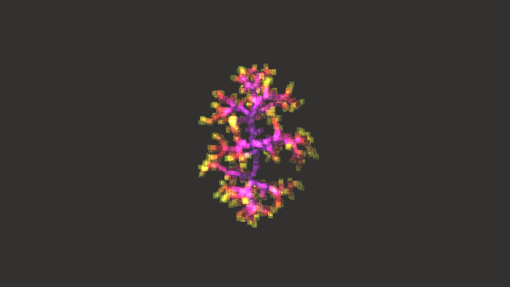

# generative_crystallization_reaction_diffusion_3d

## Metadata
- **Date**: 2026-06-20
- **Theme**: 3D geometric crystallization mimicking a reaction-diffusion/DLA system growing outward from a center
- **Technique**: An optimized 3D Diffusion-Limited Aggregation (DLA) algorithm. Particles spawn on a sphere and walk towards the existing crystal structure until they stick. Rendered with additive blending and neon purples/magentas to give a crystalline sci-fi aesthetic.
- **Logic Lab Reference**: 

## Concept
3D geometric crystallization mimicking a reaction-diffusion/DLA system growing outward from a center point.

## Technical Details
- **Renderer**: Unknown
- **Simulation**: Unknown
- **Visuals**: Unknown
- **Animation**: Contains animation details
