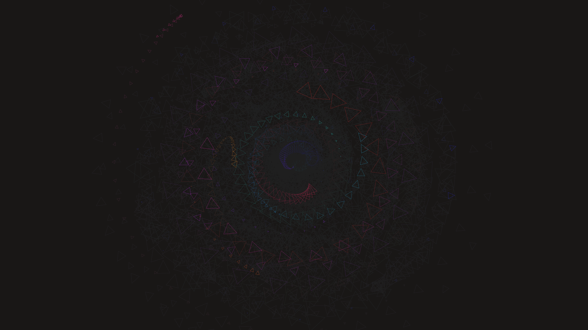

# generative_crystallized_topography_2d

A microscopic view of an alien geometric crystal growing through a rugged landscape.

## Details
- **Date**: 2026-06-20
- **Technique**: A 2D simulation using space colonization, rendering dense fractal layers of sharp intersecting triangles.
- **Format**: Animation (10s @ 60fps)
